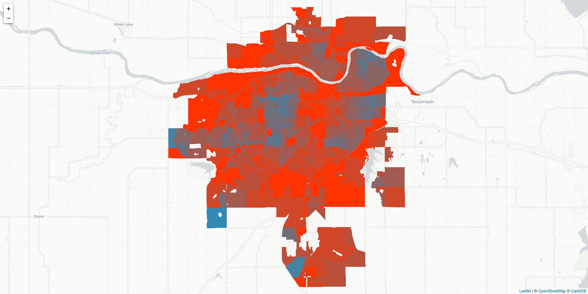
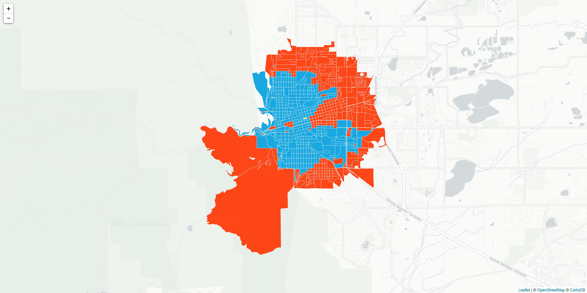

map-tools
=========
PeopleForBikes' Bike Network Analysis (BNA) scores cities and other geographic areas based on the quality of their low-stress bike network. The BNA generates output data that can be used to generate a variety of maps, including those visible on the BNA website. The `map-tools` repository provides resources to facilitate BNA data visualization and enhance the BNA's utility as a free, public resource for bike data analysis and advocacy.

### Prerequisites
Depending on the functions that you choose to use, you will need some portion of the following open-source resources:
* Python 3.6+
   * Python libraries: pandas, geopandas, numpy, os 
* R 3.4.3+
   * R libraries: leaflet, geojsonio, mapview, dplyr, tools
* QGIS

## Heat Map

The heat map on the BNA website is the "Census blocks with access" map, which colors the map according to each census block's BNA score on a scale of 0 to 100. The map on the BNA website uses a scale with natural breaks, so the uppermost category is 54-100. The script included here creates a map with equal intervals of 10, so the resulting map will typically be more red/purple than the map on the website. You can see examples of the equal interval heat maps for BNA-rated cities on PeopleForBikes' [City Ratings website](https://cityratings.peopleforbikes.org/), on the downloadable PDF summary sheets available for each city. 

Example: [Santa Fe, NM City Ratings](https://cityratings.peopleforbikes.org/wp-content/uploads/2018/04/santafeNM.pdf)

#### Create Map with GIS Editor
To replicate the heat map using a GIS editing program, assign colors as follows. Do not assign colors to blocks lacking a BNA score.
 
| Block score   | Hex color  |
----------------|:----------:|
| 0-10          | #FF3300    |
| 10-20         | #D04628    |
| 20-30         | #B9503C    |
| 30-40         | #A25A51    |
| 40-50         | #8B6465    |
| 50-60         | #736D79    |
| 60-70         | #5C778D    |
| 70-80         | #4581A2    |
| 80-90         | #2E8BB6    |
| 90-100        | #009FDF    |

A QGIS layer style file `heatmap_equalint.qml` is included as a shortcut to replicate the map in the QGIS editing program.

#### Create Map Programmatically

1. Convert the census blocks shapefile into a json or geoson file in the WGS 84 coordinate system. You can do this using a GIS program such as QGIS or ArcGIS, or you can do this programmatically. A Python script to do this programmatically will be added soon.
2. Run the `makeheatmap.r` script using the json or geojson file(s) as input. The script is written in R to take advantage of the Leaflet for R library.

## Connected Blocks Map
 
The Connected Blocks map is not one of the maps viewable on the BNA website but can be produced from the "neighborhood_census_blocks" shapefile and "neighborhood_connected_census_blocks" csv. The Connected Blocks map is a map of a designated census block (the source block) and all other census blocks (the target blocks) within the bikeshed radius of that source block as measured on the road network. The map illustrates which blocks within the bikeshed are reachable from the source block via the low stress network and which are not. In the illustration below, blocks reachable via a low stress route are blue and blocks reachable only via a high stress route are orange/red. The source block is yellow. Visualizing accessibility to a single census block is useful to understand more specific location-based accesibility and barriers within the bikeshed. The default bikeshed distance for all BNA-rated cities is 2680 meters, or approximately 1.7 miles. 

#### 1. Select source block

Use the Census Blocks shapefile to identify the full ID number of the source block of interest to you. The ID will be labeled BLOCKID10 and will be 15 digits. Omit any leading zeros. For example, census block 080130122043010 would be `'80130122043010'`.

#### 2. Prepare data

The Census Blocks shapefile contains the geography of the area. The Connected Blocks csv contains a list of all blocks in the area as `source_blockid10` and their connection to every other block in the area as `target_blockid10`. For each source/target pair, a value of `f` (false) in the `low_stress` column indicates that the source block can only reach the target block on the high stress route. A value of `t` (true) in the `low_stress` column indicates that the source block can reach the target block via a low stress route.

For most cities, the Connected Blocks csv contains over 1 million rows, and thus cannot be fully viewed or easily manipulated within Excel or similar programs. The `merge_connected_blocks.py` script uses Python to select the designated source block from the Connected Blocks csv, identify corresponding target blocks, filter the list of blocks for those with a BNA score, and then join the source/target stress data with the Census Blocks shapefile. The resulting output is a revised Census Blocks shapefile with a `stress` column to indicate high or low stress connections to the source block. 

#### 3. Convert shapefile

As with the heat map above, the shapefile needs to be converted to a json or geojson format in the WGS 84 coordinate system.

#### 4. Create map

Once the shapefile has been prepared, use the `makeconnectedmap.r` script to produce a map similar to the example above.

